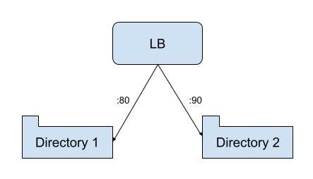
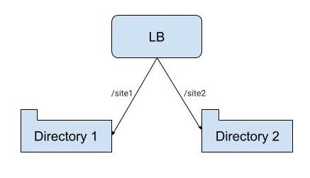

## NGinx serving static files in different directories

```
events{}
http{
    include mime.types;
    server{
        listen 80;
        server_name localhost;
        root /usr/local/opt/nginx/html/site01;
    }
    server{
        listen 90;
        server_name localhost;
        root /usr/local/opt/nginx/html/site02;
    }
}
```

## NGinx serving static files trhough differents locations

```
events{}
http{
    include mime.types;
    server{
        listen 80;
        server_name localhost;
        #Prefix match
        location /site1 {
            alias /usr/local/opt/nginx/html/site01/;
        }
        #Prefix match
        location /site2 {
            alias /usr/local/opt/nginx/html/site02/;
        }
    }
}
```